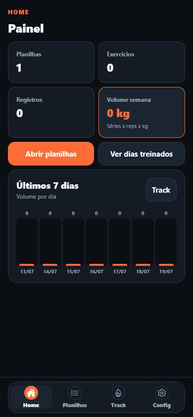
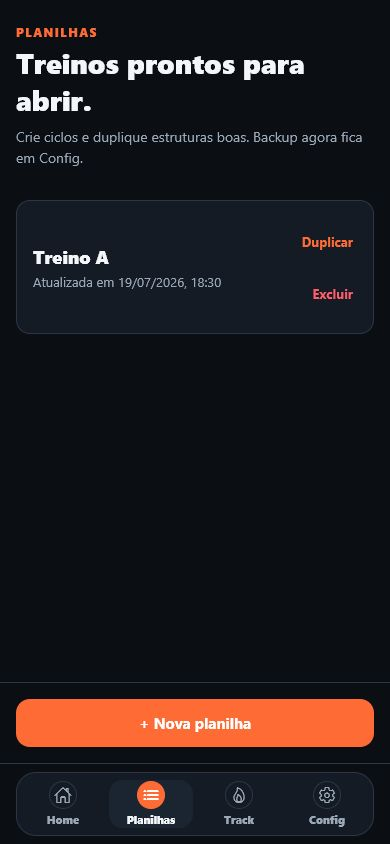
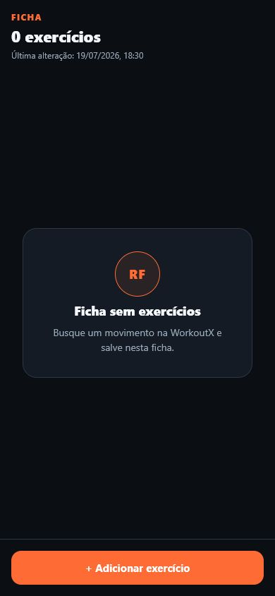
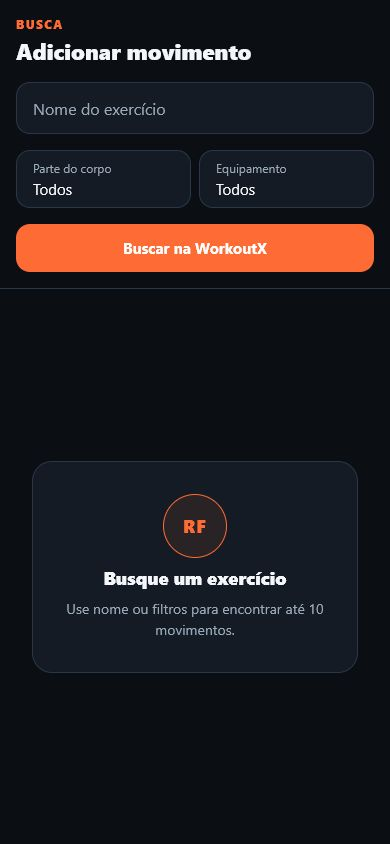
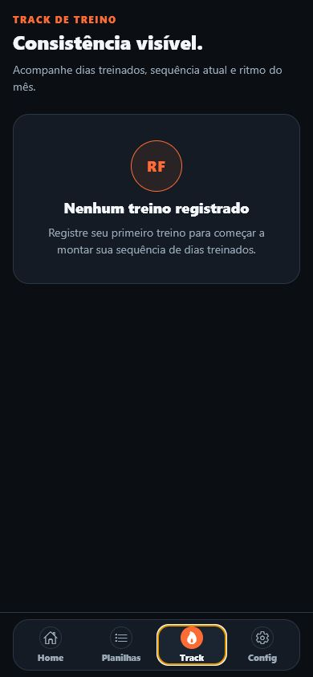
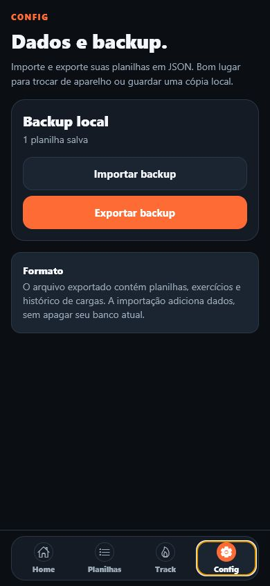

# RepForge


RepForge é um app Android nativo, offline-first, para montar fichas de treino,
registrar cargas e acompanhar evolução sem depender de conta ou nuvem.

O produto atual usa Kotlin, Jetpack Compose, Material 3, ViewModel, Coroutines
e Room. O diretório `app/` é a fonte do APK; o código Expo/TypeScript legado
permanece apenas como referência de migração e não participa do build Kotlin.

## Screenshots

Preview mobile web em viewport `390x844`.

| Home | Planilhas | Ficha |
| --- | --- | --- |
|  |  |  |

| Busca | Track | Config |
| --- | --- | --- |
|  |  |  |

## O que ele faz

- Cria, duplica e remove fichas de treino.
- Busca exercicios na WorkoutX com filtros de nome, parte do corpo e equipamento.
- Salva nome, GIF e dados do exercicio no banco local.
- Registra series, repeticoes e carga em kg.
- Mostra historico, ultimo registro, volume, PR de carga e 1RM estimado.
- Mostra dashboard com volume semanal, totais e barras dos ultimos 7 dias.
- Inclui timer de descanso ajustavel.
- Exporta e importa backup JSON.
- Usa interface escura em portugues, pensada para celular.

## WorkoutX API

RepForge nao embute chave WorkoutX no APK.

Motivo: APK e codigo cliente. Qualquer chave colocada em JavaScript, `.env`,
`EXPO_PUBLIC_*`, `app.json`, asset ou recurso nativo pode ser extraida por
alguem que descompile o APK ou inspecione as requisicoes.

Opcoes seguras:

- **Distribuicao publica usando sua chave:** crie um backend proxy. O app chama
  seu servidor, e o servidor chama a WorkoutX com `X-WorkoutX-Key`. Assim o APK
  recebe apenas a URL publica do proxy, nunca a chave.

O build publico atual usa proxy Cloudflare. A tela `Config` fica dedicada a
backup/importacao e nao pede chave WorkoutX do usuario.

### Proxy Cloudflare gratuito

Para distribuir o APK usando sua chave sem mostra-la no app, use o Worker em
`proxy/`.

```bash
cd proxy
npm install
npx wrangler login
npx wrangler kv namespace create USAGE
```

Copie o `id` retornado para `proxy/wrangler.jsonc`, depois configure a chave:

```bash
npx wrangler secret put WORKOUTX_API_KEY
npm run deploy
```

O app ja vem configurado para usar:

```text
https://repforge-workoutx-proxy.repforge-rafael.workers.dev
```

Esse valor pode ir no APK porque e apenas a URL do proxy. A chave real fica no
Cloudflare. Se quiser trocar o proxy em build local, use `.env.local`:

```text
EXPO_PUBLIC_WORKOUTX_PROXY_URL=https://outro-proxy.workers.dev
```

O proxy limita gasto de API por cache miss:

- `PER_INSTALL_DAILY_LIMIT=60`
- `GLOBAL_DAILY_LIMIT=450`
- burst: `10` requisicoes/minuto por instalacao

Se sua chave WorkoutX for free com 500 requisicoes/mes, use
`GLOBAL_DAILY_LIMIT=15`.

## Build Kotlin para desenvolvimento

Requisitos: JDK 21 e Android SDK com API 35+.

```powershell
./gradlew.bat :app:testDebugUnitTest
./gradlew.bat :app:assembleDebug
```

APK: `app/build/outputs/apk/debug/app-debug.apk`.

Instalar em dispositivo/emulador:

```powershell
adb install -r app/build/outputs/apk/debug/app-debug.apk
adb shell monkey -p com.repforge.app 1
```

## Legado Expo

O código Expo/TypeScript original permanece versionado para referência durante
a migração. Não é necessário para compilar, instalar ou testar o app Kotlin.

Para consultar o preview legado, use `Terminal > Run Task`:

- `Preview: Web`
- `Preview: Expo Go`

Ou rode direto:

```bash
npm run web
npm start
```

O foco do projeto e Android. Web existe para preview rapido.

## Proxy WorkoutX

O APK não contém chave secreta. `WorkoutXClient` chama o proxy configurado em
`app/src/main/java/com/repforge/app/data/WorkoutXClient.kt`; a chave real deve
existir somente no ambiente do proxy Cloudflare em `proxy/`. Criação manual e
registro de treino continuam funcionando offline.

## Gerar APK

```bash
npm run lint
npm run typecheck
npm test
npx eas-cli build --platform android --profile preview
```

O perfil `preview` gera APK instalavel. O perfil `production` fica reservado
para AAB/loja.

## Backup

Exportacao gera arquivo no formato:

```text
repforge-backup-YYYY-MM-DD.json
```

Importacao:

- valida o arquivo antes de escrever;
- adiciona dados sem apagar banco atual;
- roda em transacao exclusiva;
- faz rollback completo se algo falhar.

Backup contem dados de treino em texto legivel. Compartilhe com cuidado.

## Banco local

Banco: `repforge.db`

Tabelas:

- `sheets`: fichas de treino
- `exercises`: exercicios da ficha
- `entries`: historico de carga
- `app_settings`: configuracoes locais, incluindo chave WorkoutX do usuario

O schema ativa `PRAGMA foreign_keys = ON`, usa exclusao em cascata e
`PRAGMA user_version = 2`.

## Estrutura Kotlin

```text
app/src/main/java/com/repforge/app/
├── data/          # Room, backup, settings e WorkoutX
├── domain/        # modelos, contratos, validações e métricas
└── presentation/  # Compose, ViewModels e tema
```

## Qualidade

```powershell
./gradlew.bat :app:testDebugUnitTest
./gradlew.bat :app:assembleDebug
```

Testes atuais cobrem validação de séries e cálculo de 1RM; o fluxo principal
também foi validado no emulador Android com persistência Room.

## Release

1. Atualize `package.json`, `package-lock.json`, `app.json` e `versionCode`.
2. Rode lint, typecheck e testes.
3. Gere APK com EAS preview.
4. Baixe o APK.
5. Crie tag e release no GitHub.

## Licenca

MIT. Veja [LICENSE](LICENSE).
